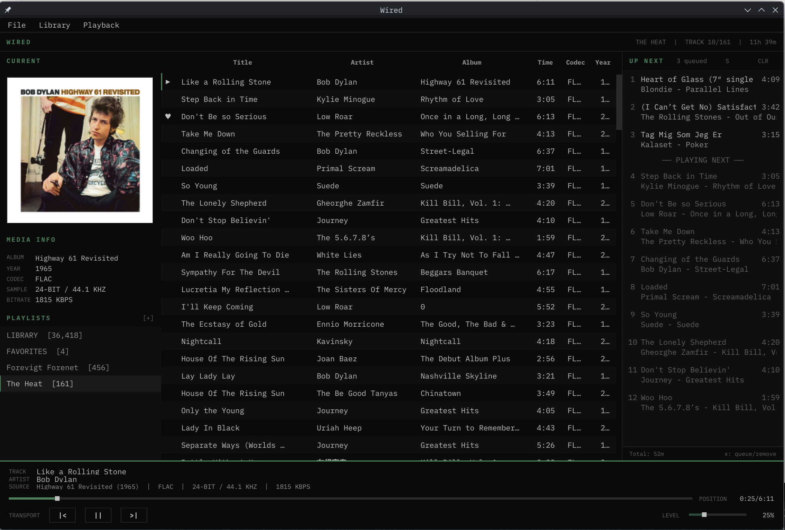

# WIRED

Local music player for users who value information density over visual minimalism.

```
STATUS .............. OPERATIONAL
VERSION ............. 0.1.0
LICENSE ............. MIT
PLATFORM ............ LINUX
```

---

## OVERVIEW



The application is designed for users who:
- Maintain a local music library
- Like keyboard shortcuts but also appreciate using the mouse
- Want metadata visibility without visual clutter
- Need easy to use and understand playlists and queue.
    - Reminiscent of traditional streaming players like Spotify

---

## SYSTEM REQUIREMENTS

```
COMPONENT           REQUIREMENT
-------------------------------------------------
Operating System    Linux (tested on Arch/EndeavourOS)
Python              3.11 or higher
VLC                 System installation required
Display             1280x720 minimum resolution
```

---

## INSTALLATION

### 1. Clone Repository

```
git clone <repository-url>
cd wired
```

### 2. Create Virtual Environment

```
python -m venv venv
source venv/bin/activate
```

### 3. Install Dependencies

```
pip install -r requirements.txt
```

Dependencies:
- PyQt6 - GUI framework
- python-vlc - Audio playback
- mutagen - Metadata reading
- dbus-python - MPRIS2 system integration

### 4. Verify VLC Installation

```
vlc --version
```

If VLC is not installed:
```
# Arch/EndeavourOS
sudo pacman -S vlc

# Debian/Ubuntu
sudo apt install vlc

# Fedora
sudo dnf install vlc
```

### 5. Launch Application

```
python main.py
```

---

## INTERFACE LAYOUT

```
+---------------------------+---------------------------------------+
| CURRENT                   | HEADER BAR                            |
|  [Album Art]              +---------------------------------------+
|                           | #  | TITLE      | ARTIST   | ALBUM    |
+---------------------------+ 01 | Track One  | Artist A | Album X  |
| MEDIA INFO                | 02 | Track Two  | Artist B | Album Y  |
|  ALBUM    Album Name      |>03 | Playing    | Artist C | Album Z  |
|  YEAR     2024            | 04 | Track Four | Artist D | Album W  |
|  CODEC    FLAC            |                                       |
|  SAMPLE   16-BIT / 44 KHZ |                                       |
|  BITRATE  1411 KBPS       |                                       |
+---------------------------+---------------------------------------+
| PLAYLISTS            [+]  | TRACK    Currently Playing Track      |
|  LIBRARY  [1,234]         | ARTIST   Artist Name                  |
|  FAVORITES  [42]          +---------------------------------------+
|  Playlist One  [45]       | SOURCE   | POSITION | TRANSPORT| LEVEL|
+---------------------------+---------------------------------------+
```

---

## KEYBOARD REFERENCE

### TRANSPORT CONTROLS

```
KEY             ACTION
-------------------------------------------------
Space           Play / Pause
Left Arrow      Previous track
Right Arrow     Next track
+ / =           Volume up (5%)
-               Volume down (5%)
```

### NAVIGATION

```
KEY             ACTION
-------------------------------------------------
Up / Down       Navigate track list
Enter           Play selected track
f  /  /         Open search overlay
Ctrl+F          Open filter overlay
Escape          Close overlay / Clear filters
q               Toggle queue panel
s               Toggle shuffle mode
g               Open artist view
l               Toggle favorite status
```

### QUEUE OPERATIONS

```
KEY             ACTION
-------------------------------------------------
n               Play next (insert at queue front)
a               Add to queue (append to queue end)
x               Toggle queue status
```

### PLAYLIST OPERATIONS

```
KEY             ACTION
-------------------------------------------------
Delete          Remove from playlist (playlist view only)
```

### APPLICATION

```
KEY             ACTION
-------------------------------------------------
Ctrl+O          Open folder (temporary, does not affect database)
Ctrl+I          Import M3U playlist
Ctrl+Q          Quit application
```

---

## FEATURES

### LIBRARY MANAGEMENT

- SQLite-cached metadata for sub-second startup
- Background scanning with progress indication
- Incremental updates (detects added/removed files)
- Supported formats: MP3, FLAC, OGG, WAV, M4A, OPUS

### SEARCH SYSTEM

Telescope-style fuzzy search accessible via `f` or `/`:
- Searches across title, artist, album fields
- Results ranked by match quality
- Artist results link to artist dossier view

### FILTER SYSTEM

Multi-field filtering accessible via `Ctrl+F`:
- Filter by artist, album, year, genre, codec, favorite
- OR logic within filters using `|` (e.g., `artist:metallica | genre:metal`)
- Year ranges supported (e.g., `year:1980-1990`)
- Multiple filter chips combine with AND logic
- Save filter results as new playlist

### FAVORITES

Mark tracks as favorites for quick access:
- Toggle favorite status with `l` key
- ♥ indicator displayed in track list
- Dedicated FAVORITES view in sidebar
- Filter by favorites using `favorite:yes`

### QUEUE SYSTEM

Manual queue for controlling playback order:
- Play Next: Insert track at front of queue
- Add to Queue: Append track to end of queue
- Queue persists when browsing different views
- Queue state saved on application exit

### PLAYLIST MANAGEMENT

- Create, rename, delete playlists
- Bulk add/remove tracks
- M3U import and export
- Track counts displayed in sidebar

### ARTIST DOSSIER

Album grid view for individual artists:
- Discography with cover art
- Statistics (tracks, albums, total duration)
- Keyboard navigation through albums
- Play All functionality

---

## CONFIGURATION

Settings stored at: `~/.config/wired/config.ini`

Persisted state includes:
- Window geometry
- Volume level
- Queue contents
- Panel visibility
- Shuffle state
- Library path
- Favorite tracks

---

## FILE SUPPORT

```
FORMAT          EXTENSION       METADATA
-------------------------------------------------
FLAC            .flac           Vorbis Comments
MP3             .mp3            ID3v2
OGG Vorbis      .ogg            Vorbis Comments
WAV             .wav            Limited
M4A/AAC         .m4a            MP4 Tags
Opus            .opus           Vorbis Comments
```

---

## ARCHITECTURE

```
wired/
├── main.py .................. Entry point
├── requirements.txt
├── assets/
│   └── wired.svg ............ Application icon
└── player/
    ├── core/
    │   ├── audio.py ......... VLC playback engine
    │   ├── database.py ...... SQLite operations
    │   ├── library.py ....... Directory scanning
    │   ├── metadata.py ...... Track data structure
    │   ├── mpris.py ......... MPRIS2 D-Bus service
    │   ├── playlist.py ...... In-memory playlist
    │   ├── playlist_manager.py  Saved playlist storage
    │   └── queue.py ......... Manual queue
    ├── ui/
    │   ├── main_window.py ... Application container
    │   ├── sidebar.py ....... Album art + info + playlists
    │   ├── playlist_view.py . Track table
    │   ├── player_bar.py .... Transport controls
    │   ├── queue_panel.py ... Queue display (dynamic sizing)
    │   ├── search_overlay.py  Fuzzy search
    │   ├── filter_overlay.py  Field filtering
    │   └── artist_overlay.py  Artist dossier
    ├── theme/
    │   └── lainchan.py ...... Colors + stylesheet
    └── utils/
        ├── config.py ........ Settings persistence
        └── search.py ........ Search algorithms
```

---

## KNOWN LIMITATIONS

```
LIMITATION                  NOTES
-------------------------------------------------
VLC dependency              System VLC installation required
First scan performance      Large libraries may take time
Album art source            Embedded tags only (no folder.jpg)
Gapless playback            Not implemented
Crossfade                   Not implemented
```

---

## SYSTEM INTEGRATION

### MPRIS2 D-Bus

Wired exposes MPRIS2 interfaces for desktop integration:

```
BUS NAME ............ org.mpris.MediaPlayer2.wired
OBJECT PATH ......... /org/mpris/MediaPlayer2
```

Features:
- Media key support (play/pause/next/prev)
- Track info in notification daemons
- KDE Plasma media widget integration
- Control via playerctl

```bash
# Example playerctl commands
playerctl -p wired play-pause
playerctl -p wired next
playerctl -p wired metadata
```

### Desktop Entry

To add Wired to your application launcher, create `~/.local/share/applications/wired.desktop`:

```ini
[Desktop Entry]
Type=Application
Name=Wired
Comment=Local music player for Wired people
Exec=/path/to/venv/bin/python /path/to/main.py
Icon=/path/to/assets/wired.svg
Terminal=false
Categories=Audio;Music;Player;AudioVideo;
Keywords=music;audio;player;mpris;
StartupWMClass=wired
```

Update the `Exec` and `Icon` paths to match your installation.

---

## TROUBLESHOOTING

### Application fails to start

Verify VLC installation:
```
python -c "import vlc; print(vlc.libvlc_get_version())"
```

### No audio output

Check VLC audio configuration:
```
vlc --aout=pulse  # or alsa, jack
```

### Missing metadata

Ensure files have embedded tags. Use a tool like `kid3` or `picard` to verify and edit metadata.

### Database corruption

Remove the database file to force rescan:
```
rm ~/.config/wired/library.db
```

This will delete your saved playlists and favorite status.

---

## DEVELOPMENT

### Running from source

```
source venv/bin/activate
python main.py
```

### Project documentation

See `context.md` for detailed development notes, architecture decisions, and implementation status.

---

## LICENSE

MIT License. See LICENSE file for full text.
